# 实验报告

- 课程名称：编程语言原理与编译
- 实验项目：期末大作业
- 专业班级：计算机2001 计算机2002
- 学生学号：32001027 320010
- 学生姓名：常睿嘉 司晨旭 
- 实验指导教师：郭鸣

## 实验内容

#### 分工：

| 姓名   | 学号     | 班级       | 任务                               | 权重   |
| ------ | -------- | ---------- | ---------------------------------- | ------ |
| Name   | No.      | Class      | Task                               | Factor |
| 常睿嘉 | 32001027 | 计算机2001 | 解释器（主要）、编译器、测试、文档 | 0.95   |
| 司晨旭 | 320010   | 计算机2002 | 解释器、编译器（主要）、测试、文档 | 0.95   |

#### 成员代码提交日志：

- 常睿嘉：


- 司晨旭：


#### 项目自评等级(1-5)：

| 功能                               | 评分 | 备注 |
| ---------------------------------- | ---- | ---- |
| 注释(* *)                          | 5    |      |
| __开头的名字不允许                 | 5    |      |
| DoWhile循环                        | 5    |      |
| DoUntil循环                        | 5    |      |
| 三目运算                           | 5    |      |
| +=、-=、*=、/=、%=语法糖           | 5    |      |
| for循环                            | 5    |      |
| for i in range(until)              | 5    |      |
| for i in range(start, until)       | 5    |      |
| for i in range(start, until, step) | 5    |      |
| i++  i--                           | 4    |      |
| ++i --i                            | 4    |      |
| switch case                        | 4    |      |
| 数据初值定义                       | 5    |      |
| float类型                          | 4    |      |
| bool类型                           | 5    |      |
| 各类数组，数组检查                 | 5    |      |
| char类型                           | 5    |      |
|                                    |      |      |

#### 项目说明：

- 前端：由`F#`语言编写而成
  - `Absyn.fs`: 抽象语法树结构的定义
  - `CLex.fsl`: 词法定义
    - `CLex.fs`：由`CLex.fsl`生成的词法分析器
  - `CPar.fsy`: 语法定义
    - `CPar.fs`：由`CPar.fsy`生成的语法分析器
  - `Parse.fs`: 语法解析器（从文件或字符串中获取抽象语法树）
  - `Interp.fs`: 解释器
  - `Comp.fs`: 编译器
  - `Contcomp.fs`: 优化编译器
  - `Machine.fs`: 栈式虚拟机指令的定义及将其转化为机器指令序列
- 后端：由`C`语言编写而成
  - `machine.c`: 栈式虚拟机
- 测试：测试程序放在`testCase`文件夹内

- 使用方法

  **解释器：**

  ```
  dotnet restore  interpc.fsproj
  dotnet clean  interpc.fsproj
  dotnet build -v n interpc.fsproj
  dotnet run -p interpc.fsproj .\example\myex1.c 3  # 解释执行
  ```

  **编译器：**

  ```
  dotnet restore  microc.fsproj
  dotnet clean  microc.fsproj
  dotnet build  microc.fsproj  
  gcc machine.c -o machine  # 不用每次  改了machine.c再编译过即可
  
  dotnet run -p microc.fsproj .\example\myex1.c 3  # 编译
  .\machine.exe .\example\myex1.out 3  # 执行
  ```

  **优化编译器**

  ```
  dotnet restore  microcc.fsproj
  dotnet clean  microcc.fsproj
  dotnet build  microcc.fsproj
  dotnet run -p microcc.fsproj .\example\myex1.c 3
  .\machine.exe .\example\myex1.out 3
  ```

#### 功能实现及解决技术要点说明：

### 1、增加注释的表示方式(* *)

测试代码testCase/starComment.c

未加(* *)时，输入2，输出5：


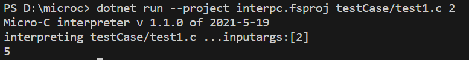

增加(* *)时，输入2，输出2：


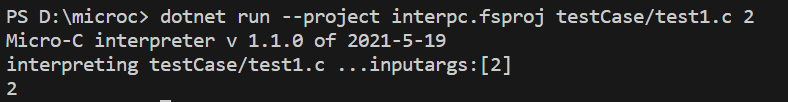

生成的token序列以及抽象语法树：


程序结束后的输出以及store环境：


### 2、实现DoWhile

先执行函数体`body `的内容，因为执行`exec`会改变`store`的内容，所以先返回变更的环境；然后将`do`中表达式的值传给`v`  如果条件等于0（条件为真）就继续执行循环

测试代码testCase/doWhile.c

输入2，输出0：


输入5，输出10：


生成的token序列以及抽象语法树：


程序结束后的输出以及store环境：


**编译器：**

测试：


输出：（输入5 ，输出10）


### 3、实现DoUntil

与DoWhile类似，只不过`v`不等于0（条件为假）继续执行循环

测试代码testCase/test3.c

更名为 doUntil.c

无输入，经过do until循环后，输出5：


生成的token序列以及抽象语法树：


程序结束后的输出以及store环境：

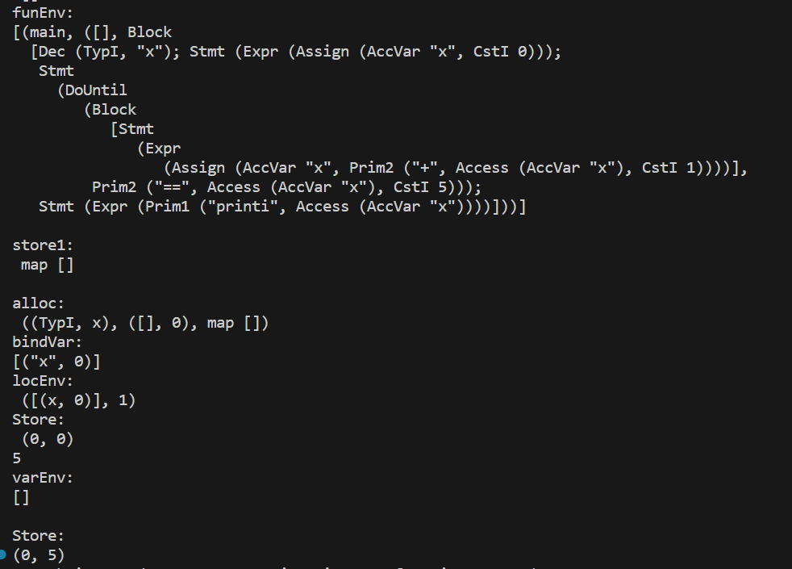

**编译器：**

测试：


输出：5


### 4、三目运算

三目运算符为右值表达式，如果`?`前的表达式的值为真时，将`:`前的值存入，否则存入`:`后的值

测试代码testCase/tco.c  (*ternary conditional operator*)

当`?`前的表达式的值为真时：


当`?`前的表达式的值为假时：


生成的token序列以及抽象语法树：

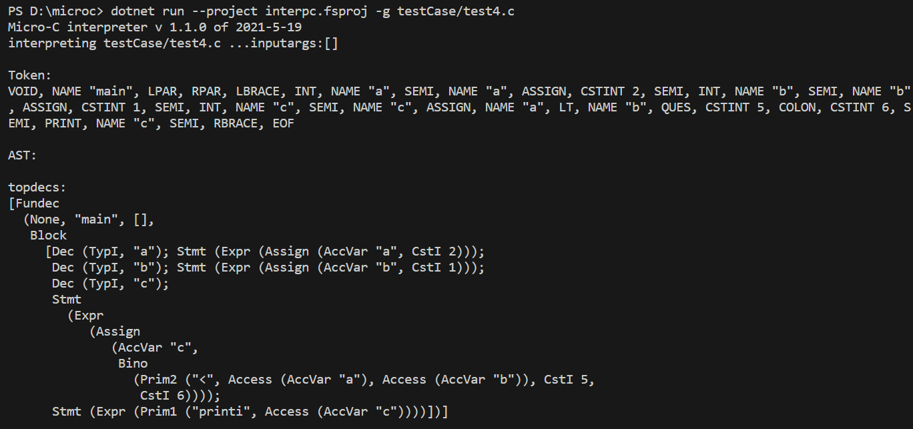

程序结束后的输出以及store环境：


### 5、+=、-=、*=、/=、%=

测试代码testCase/assignmentOperators.c


生成的token序列以及抽象语法树：


程序结束后的输出以及store环境：


**+=编译器：**

测试代码：


成功编译：


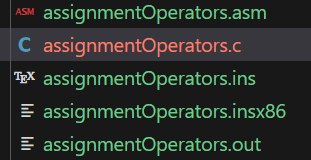

虚拟机构建与执行：输出为2


### 6、for i in range(until){...}

测试代码testCase/test7.c

更名为 forIn1.c


### 7、for i in range(start, until){...}

测试代码testCase/forIn2.c

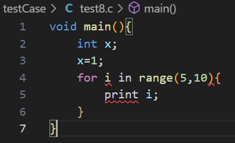


生成的token序列以及抽象语法树：


程序结束后的输出以及store环境：


### 8、for i in range(start, until, step){...}

测试代码testCase/forIn3.c


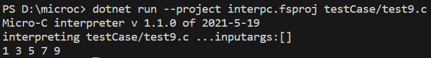

生成的token序列以及抽象语法树：


程序结束后的输出以及store环境：


### 9、i++ i--和++i --i

测试代码testCase/incAndDec.c


生成的token序列以及抽象语法树：


程序结束后的输出以及store环境：


**编译器：**

测试：

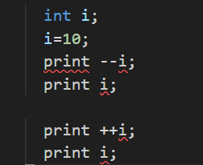

输出：9 9 10 10


### 10、switch case

测试代码testCase/mySwitch.c


生成的token序列以及抽象语法树：


程序结束后的输出以及store环境：


**编译器：**

测试：


输出：（输入为2，输出2）


### 11、变量声明时赋值

测试代码testCase/varInit.c


生成的token序列以及抽象语法树：


程序结束后的输出以及store环境：


**编译器：**

测试：


输出：1


### 12、 两个下划线开头的名字__是内部保留，不允许

测试代码testCase/test13.c

改名为 _var.c


出错提醒：cannot use variable with start __


### 13、float

测试代码1号为_float1.c

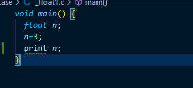

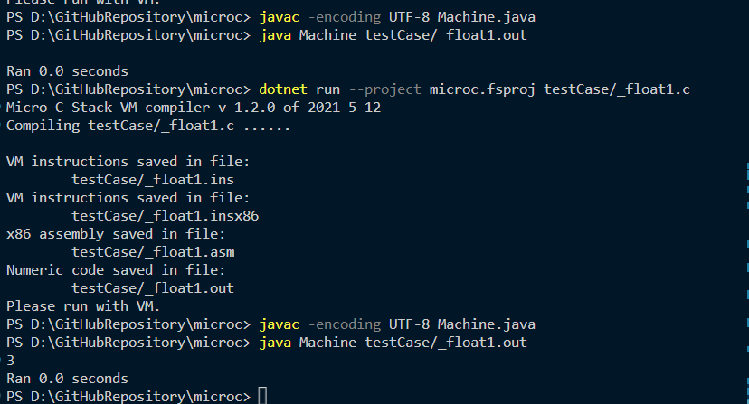

要先运行java虚拟机，报错的话就加上代码参数 `-encoding UTF-8`


### 14、for循环的初始版本

因为这个版本和后面的for in range 写法有冲突，所以去掉了，时间来得及的话再加上

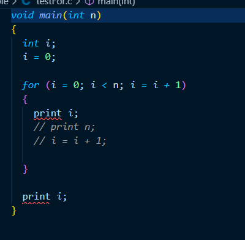

运行结果如下

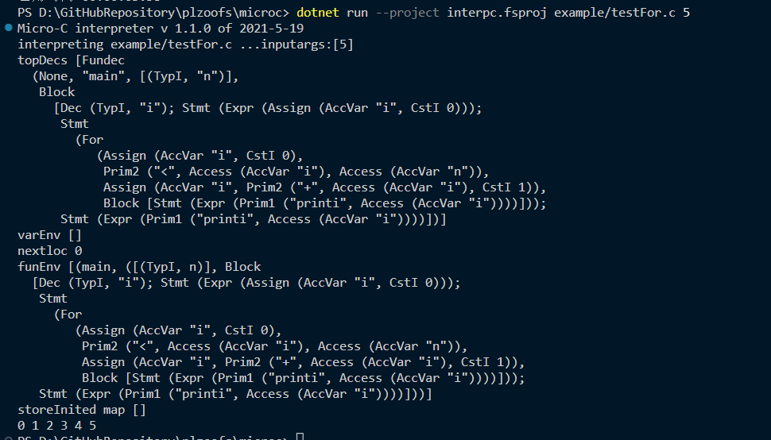


### 15、char

 测试程序为testChar.c

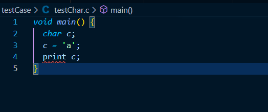

运行结果如下

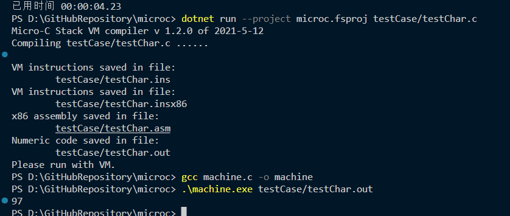


### 15、bool等


#### 心得体会（结合自己情况具体说明）：

大作业开发过程心得：

- 常睿嘉： 

  这学期的学业压力较重，特别是在面对编译原理这门比较难的科目时，我认为这门课程是大学四年相对困难的课程，之前完全没有接触过相关内容，在课堂上学习到的知识总是一知半解，课后还需要在理论知识上花费大量的时间去理解，觉得知识量太广太深。经历过这次大作业后，真正动手做工程，不仅仅停留在表面的理论，收获颇丰，对编译的本质和F#这门语言有了更具深刻的理解。

- 司晨旭：

  本学期我个人的事情较多，任务较繁杂。做项目出差，回来之后就要忙其他更早截至的大作业。因此编译原理大作业我在参与的过程中时间非常紧张。在开发过程中，由于git的冲突没有解决，导致我的上传一直出现问题。因此在我完成break，for循环，还有修改虚拟机的时候，发现有些地方组员已经写了，我不能直接进行修改了。尤其是在实现for循环的时候，在刚开始大作业的时候我就已经写好了。但是没有上传成功。再去改的时候就会把队友的for in 部分全部改爆红。还有在编写编译器的时候，发现自己写完之后要直接更改一句代码会直接把队友的所有成果弄红。这门课的大作业是我大学四年耗时最长的一门。

  实现这些功能成功的时候心里很开心，但是代码运行出问题的时候真的非常难受，在更改java虚拟机的时候，并没有爆红颜色的错误。而是直接输出的是乱码的字符串。花了一整天在解决这个问题。

本课程建议：

- 常睿嘉： 

  课程难度还是有点高，特别是大作业，突然从理论到写代码。希望老师能在平时课堂上就带着大家写写代码，实现小功能，讲解流程和理论。

  希望老师平时能讲一讲平时作业或者提供相应的答案

  希望大作业的比分降低一些，照顾大部分人的过课率

- 司晨旭：

  建议老师在授课过程中，多一些例题的讲解，有那种确确实实书面的答案。方便学生在课后回顾 。然后老师在授课过程中也可以多询问一下大家是否听懂了这些知识。因为很多时候并不能直接跟上，课后时间一长就很容易把知识忘掉了。

  学生朽木，确实平时上课难度有点大了。这门课的理论和实践都很难。


